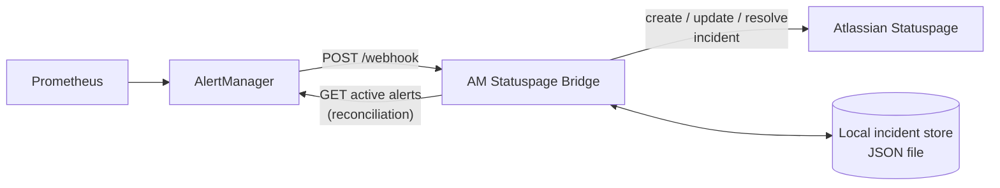

# AM Statuspage Bridge

Automatically synchronize Prometheus AlertManager alerts with Atlassian Statuspage incidents: grouping, auto-resolution, and dynamic status updates.

[](.github/workflows/ci.yml)
[](LICENSE)
[](requirements.txt)

## Overview

Prometheus and AlertManager know exactly when something breaks. Statuspage, the
page your customers actually look at, doesn't know anything unless a human
opens it and creates an incident by hand. In practice that means outages are
either reported late, reported inconsistently, or not reported at all.

AM Statuspage Bridge sits between AlertManager and Statuspage and closes that
gap: it receives AlertManager webhooks, opens the matching Statuspage incident
when an alert fires, keeps it updated as related alerts come and go, and
resolves it automatically once the underlying alerts clear. No manual incident
management, no forgotten updates.

## Features

- Receives AlertManager webhook notifications (`firing` and `resolved`).
- Creates a Statuspage incident automatically when an alert fires.
- Groups multiple concurrent alerts on the same component into a single
  incident instead of spamming several.
- Escalates incident severity automatically when a second, independent alert
  stacks onto an already-open incident.
- Resolves incidents automatically once all their alerts have cleared.
- Derives the Statuspage incident impact (minor/major/critical) from the
  alert's actual severity instead of a fixed value.
- Persists running incidents to disk, so state survives a bridge restart.
- Periodically reconciles against AlertManager's active alerts, so an
  incident doesn't stay open forever if a single `resolved` webhook is lost.
- Resolves component names to Statuspage component IDs by name (including
  `Group/Component` syntax), so you don't hardcode component IDs in your
  AlertManager rules.

## How it works

**Alert fires:**

```text
AlertManager (firing)  →  Bridge  →  Statuspage incident created (or updated)
```

**Alert resolves:**

```text
AlertManager (resolved)  →  Bridge  →  Statuspage incident updated or resolved
```

The bridge tracks incidents per Statuspage component, not per alert. If two
different alerts fire on the same component, they stack onto the same
incident; the incident only resolves once every alert that contributed to it
has resolved.

## Architecture



The bridge is a single stateless-ish FastAPI service: it keeps a small amount
of state in memory (which incidents are currently open) and persists it to a
local JSON file so it survives restarts. It talks to two external systems:
AlertManager (to read currently active alerts during reconciliation) and
Statuspage (to create, update, and resolve incidents).

## Requirements

- Docker and Docker Compose (recommended), **or** Python 3.11+ to run it
  without Docker.
- A Statuspage account with API access and at least one component configured.
- A running Prometheus AlertManager instance able to reach the bridge over
  HTTP.

## Installation

```bash
git clone https://github.com/MINTYdv/am-statuspage-bridge.git
cd am-statuspage-bridge
cp .env.example .env
# edit .env with your Statuspage credentials and a webhook secret
docker compose up -d
```

The bridge listens on `9090` by default (`http://localhost:9090`). Check it
came up correctly:

```bash
curl http://localhost:9090/health
```

### Running without Docker

```bash
python3 -m venv .venv
source .venv/bin/activate
pip install -r requirements.txt
cp .env.example .env  # edit it first
export $(grep -v '^#' .env | xargs)
uvicorn statuspage_bridge:app --host 0.0.0.0 --port 9090
```

## Configuration

All configuration is read from environment variables (see [.env.example](.env.example)).

| Variable | Required | Default | Example | Effect |
|---|---|---|---|---|
| `STATUSPAGE_API_KEY` | Yes | none | `a1b2c3d4e5f6` | Statuspage API key (OAuth token) used to authenticate every call to the Statuspage API. |
| `STATUSPAGE_PAGE_ID` | Yes | none | `abc123def456` | ID of the Statuspage page the bridge manages incidents on. |
| `SECRET_WEBHOOK` | Yes | none | `$(openssl rand -hex 32)` | Shared secret AlertManager must present to call `/webhook`. The bridge refuses to start without it. |
| `ALERTMANAGER_URL` | No | `http://alertmanager:9093` | `http://alertmanager.internal:9093` | Base URL used to poll AlertManager's active alerts during reconciliation. |
| `ALERTMANAGER_POLL_INTERVAL_SECONDS` | No | `60` | `30` | How often the bridge reconciles running incidents against AlertManager's active alerts. |
| `BRIDGE_PORT` | No | `9090` | `8080` | Port the bridge listens on. |
| `INCIDENTS_STORE_PATH` | No | `/app/data/incidents_store.json` | `/app/data/incidents_store.json` | Path to the local JSON file used to persist running incidents. Under docker-compose this is mounted on a named volume. |
| `LOG_LEVEL` | No | `INFO` | `DEBUG` | Log verbosity. `DEBUG` also logs every outgoing HTTP request. |

## AlertManager configuration

Alerts are matched to Statuspage components through labels, so add them
either directly on the alert (in your Prometheus alerting rule) or via
AlertManager's label injection. The bridge reads:

| Label | Required | Meaning |
|---|---|---|
| `statuspage_components` | Yes | Component name(s) as they appear on Statuspage. Use `Group/Component` for a grouped component, or `;`-separate several names to target multiple components with one alert. |
| `statuspage_status` | Yes | Component status to set: `operational`, `degraded_performance`, `partial_outage`, `major_outage`, or `under_maintenance`. Same `;`-separated ordering as `statuspage_components` for multi-component alerts. |
| `statuspage_title` | Yes | Incident title. Supports the `{date}` placeholder. |
| `statuspage_notify` | No (default `true`) | Whether Statuspage should send subscriber notifications for this incident. |

Example Prometheus rule:

```yaml
groups:
  - name: api
    rules:
      - alert: HighErrorRate
        expr: rate(http_requests_total{status=~"5.."}[5m]) > 0.05
        for: 5m
        labels:
          statuspage_components: "API"
          statuspage_status: "partial_outage"
          statuspage_title: "Elevated error rate on the API"
        annotations:
          description: "Error rate above 5% for more than 5 minutes."
```

Example AlertManager `webhook_configs` (token via header, recommended):

```yaml
receivers:
  - name: statuspage-bridge
    webhook_configs:
      - url: "http://am-statuspage-bridge:9090/webhook"
        http_config:
          authorization:
            credentials: "<value of SECRET_WEBHOOK>"
        send_resolved: true
```

Or with the token in the URL (simpler, but the token ends up in access logs):

```yaml
receivers:
  - name: statuspage-bridge
    webhook_configs:
      - url: "http://am-statuspage-bridge:9090/webhook?token=<value of SECRET_WEBHOOK>"
        send_resolved: true
```

`send_resolved: true` is required: without it, AlertManager never calls the
bridge when an alert clears, and the bridge falls back entirely on the
periodic reconciliation pass to close incidents.

## Statuspage configuration

1. In Statuspage, go to **My Profile > API Info** to generate an API key. Use
   it as `STATUSPAGE_API_KEY`.
2. Find your page ID under **Pages**, or in the page dashboard URL:
   `https://manage.statuspage.io/pages/<STATUSPAGE_PAGE_ID>`.
3. Create the components (and, if needed, component groups) you want alerts
   to target. The bridge resolves them by name at startup, so the names used
   in `statuspage_components` must match exactly (case-insensitive).

## Usage

Once configured and connected to AlertManager, the flow is entirely
automatic. To test it manually without a real AlertManager instance:

```bash
curl -X POST "http://localhost:9090/webhook?token=<SECRET_WEBHOOK>" \
  -H "Content-Type: application/json" \
  -d '{
    "alerts": [{
      "status": "firing",
      "labels": {
        "alertname": "HighErrorRate",
        "statuspage_components": "API",
        "statuspage_status": "partial_outage",
        "statuspage_title": "Elevated error rate on the API"
      },
      "annotations": {
        "description": "Error rate above 5% for more than 5 minutes."
      }
    }]
  }'
```

## Incident lifecycle

- **First alert fires on a component with no running incident:** a new
  Statuspage incident is created with status `investigating`, its impact
  derived from the alert's `statuspage_status`, and one bullet point in the
  incident body.
- **Another alert fires on a component that already has a running incident:**
  the alert is stacked as an additional bullet point on the same incident,
  and the incident is escalated to `major_outage` / `critical` impact (two
  concurrent problems on one component are treated as worse than one).
- **The same alert fires again** (AlertManager re-sending an already-active
  notification): it's a no-op for severity, the corresponding entry is just
  refreshed.
- **An alert resolves and it was the last one on the incident:** the incident
  is marked `resolved` on Statuspage and the component is set back to
  `operational`.
- **An alert resolves but others are still active on the same incident:** its
  bullet point is removed and the incident stays open at its current
  severity (severity is never downgraded automatically; it stays escalated
  until the incident closes).

## Grouping

Grouping happens per Statuspage component, not per alert or per alert name.
An alert whose `statuspage_components` lists several components (`;`-separated)
does **not** create one shared incident: it contributes an independent entry
to each targeted component's own incident, exactly as if it were several
separate single-component alerts.

## Dynamic status

Two different things are updated dynamically:

- **Component status** on the Statuspage page (`operational`,
  `degraded_performance`, `partial_outage`, `major_outage`,
  `under_maintenance`), taken directly from the alert's `statuspage_status`
  label.
- **Incident impact** (the severity badge shown with the incident itself),
  derived from the incident's current status:

  | Component status | Incident impact |
  |---|---|
  | `major_outage` | `critical` |
  | `partial_outage` | `major` |
  | `degraded_performance` | `minor` |
  | `under_maintenance` | `minor` |
  | `operational` | `none` |

## Reliability

- **Idempotence:** re-processing the same `firing` alert for an alert already
  tracked on an incident does not create a duplicate incident or double the
  entry; it just refreshes it.
- **Retries:** the bridge does not retry failed Statuspage API calls itself.
  A failed call makes the webhook handler return `HTTP 500`, and AlertManager
  retries webhook delivery on its own with its usual backoff.
- **Persistence:** running incidents are written to a local JSON file after
  every change, using an atomic write (temp file + rename), so a crash
  mid-write never corrupts the store.
- **Recovery:** on startup, the bridge reloads persisted incidents and
  immediately runs a reconciliation pass against AlertManager's currently
  active alerts, closing anything that resolved while it was down.
- **Missed webhooks:** every `ALERTMANAGER_POLL_INTERVAL_SECONDS`, the bridge
  compares running incidents against AlertManager's active alerts and
  resolves anything no longer firing, independent of whether the `resolved`
  webhook was ever received.
- **Single-instance state:** incident state lives in the process memory and a
  local file. Do not run more than one replica/worker against the same
  `INCIDENTS_STORE_PATH` without external coordination, or you risk duplicate
  incident creation.

## API

| Endpoint | Method | Description |
|---|---|---|
| `/health` | `GET` | Returns `200` with `{"status": "healthy", ...}` once the bridge finished startup (Statuspage reachable, components loaded); `503` before that. |
| `/webhook` | `POST` | AlertManager webhook receiver. Requires the shared secret, either as `?token=` or `Authorization: Bearer <token>`. |

## Health checks

`GET /health` reflects whether the bridge completed startup successfully, not
whether Statuspage is reachable at that exact moment (it doesn't re-check
Statuspage on every health probe). Docker Compose and the provided
`Dockerfile` `HEALTHCHECK` both use this endpoint.

## Troubleshooting

**The bridge exits immediately after starting.**
Check the logs: it fails fast (by design) if `STATUSPAGE_API_KEY`,
`STATUSPAGE_PAGE_ID`, or `SECRET_WEBHOOK` is missing, or if it can't reach
the Statuspage API with the credentials provided.

**`401 Unauthorized` on `/webhook`.**
The token AlertManager sent doesn't match `SECRET_WEBHOOK`. Check the
`webhook_configs` URL/header in AlertManager against your `.env`.

**"Component with name '...' not found in Statuspage components."**
The `statuspage_components` label doesn't match a component name on your
Statuspage page exactly (matching is case-insensitive but not fuzzy). Check
spelling, and use `Group/Component` if the component belongs to a group.

**Incidents are never marked resolved.**
Make sure `send_resolved: true` is set on the AlertManager webhook receiver.
If it isn't, the bridge only catches the resolution on the next
reconciliation pass (`ALERTMANAGER_POLL_INTERVAL_SECONDS`), not immediately.

**Incidents don't reappear after a restart.**
Confirm `INCIDENTS_STORE_PATH` points at a persisted volume (the provided
`docker-compose.yml` already does this). If the file is lost, the bridge
starts with no known running incidents and will create new ones for any
alert still firing.

**Debugging a failed sync.**
Set `LOG_LEVEL=DEBUG` and check the logs around the alert name in question;
every state-changing action logs an explicit `[SUCCESS]` or `ERROR` line
naming the incident and component involved.

## FAQ

**What happens when AlertManager sends the same alert multiple times?**
Nothing changes on Statuspage beyond a refreshed entry; no duplicate incident
or duplicate bullet point is created.

**What happens if Statuspage is temporarily unavailable?**
The bridge returns `HTTP 500` to AlertManager for that delivery. AlertManager
retries webhook delivery on its own; the alert's state in the bridge is only
updated once a Statuspage call actually succeeds.

**What happens when the bridge restarts?**
It reloads the incidents it had persisted to disk and immediately runs a
reconciliation pass against AlertManager to catch up on anything that
resolved while it was down.

**Can multiple alerts create a single incident?**
Yes, if they target the same Statuspage component: they stack onto the same
incident. Alerts on different components always get independent incidents.

**How are resolved alerts handled?**
The corresponding entry is removed from its incident. If it was the last
entry, the incident is resolved on Statuspage; otherwise the incident stays
open with the remaining entries.

**Can I run it without Docker?**
Yes, see [Running without Docker](#running-without-docker).

**How do I secure the webhook?**
Set a long random `SECRET_WEBHOOK` and prefer the `Authorization: Bearer`
header over the `?token=` query parameter (see
[AlertManager configuration](#alertmanager-configuration)).

**What happens if an incident already exists for a component (created
outside the bridge, e.g. manually on Statuspage)?**
The bridge only tracks incidents it created itself. It has no way to detect
or take over a pre-existing incident it didn't create, so a new alert firing
on that component creates a separate bridge-managed incident alongside it.

**How do I debug a failed synchronization?**
See [Troubleshooting](#troubleshooting).

## Development

```bash
git clone https://github.com/MINTYdv/am-statuspage-bridge.git
cd am-statuspage-bridge
python3 -m venv .venv
source .venv/bin/activate
pip install -r requirements-dev.txt
```

See [CONTRIBUTING.md](CONTRIBUTING.md) for the full workflow.

## Testing

```bash
pytest
ruff check .
ruff format --check .
```

## Contributing

Contributions are welcome, see [CONTRIBUTING.md](CONTRIBUTING.md).

## License

[MIT](LICENSE)

## Roadmap

- Structured (JSON) logging option for log aggregation pipelines.
- Configurable retry/backoff for outbound Statuspage API calls.
- Prometheus metrics endpoint exposing the bridge's own operational state.
- Support for managing incidents across more than one Statuspage page.
